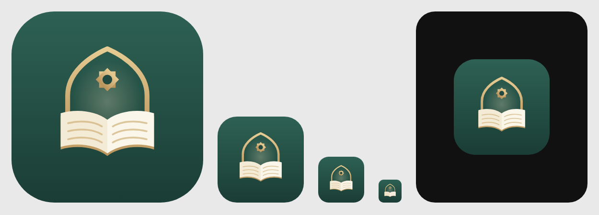
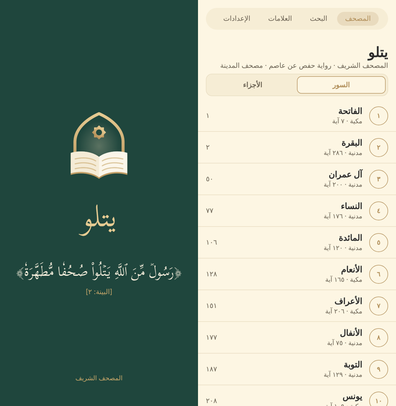

# الهوية: «يتلو»

## الاسم

**يتلو — Yatlu**، من قوله تعالى في سورة البينة (آية ٢):
«رَسُولٌ مِّنَ ٱللَّهِ يَتْلُوا صُحُفًا مُّطَهَّرَةً».

الاسم بيظهر بالمعنى ده في **الشاشة الافتتاحية** كل مرة التطبيق يفتح. نص الآية بييجي من `ayahs.json` زي ما هو (القاعدة 1)، عن طريق `NAME_AYAH_TEXT` في `src/constants/brand.ts`.

| | القيمة |
|---|---|
| الاسم بالعربي | يتلو |
| الاسم بالإنجليزي | Yatlu |
| Android package / iOS bundle ID | `com.icansoftware.yatlu` |
| الدومين المقترح | `yatlu.app` (متاح وقت البحث)، و `yatluapp.com` كبديل |
| البحث عن الاسم | [naming.md](naming.md) |

## اللوجو

**الفكرة:** مصحف مفتوح جوه قوس محراب، وفوقه نجمة ثمانية (علامة الحزب ۞ في المصحف). نور هادي جوه المحراب بيرمز لنور التلاوة. التصميم بسيط علشان يبان واضح حتى في الأحجام الصغيرة.

| الملف | الاستخدام |
|---|---|
| `assets/brand/yatlu-icon.svg` | الأيقونة كاملة بخلفية مربعة (المصدر الأساسي) |
| `assets/brand/yatlu-icon-rounded.svg` | نفس الأيقونة بحواف دائرية (للعرض والمواقع) |
| `assets/brand/yatlu-mark.svg` | العلامة لوحدها بخلفية شفافة |
| `assets/brand/yatlu-monochrome.svg` | نسخة بلون واحد (أيقونات أندرويد 13 المتلونة) |

الصور اللي التطبيق بيستخدمها متولّدة من ملفات الـ SVG دي:

| الملف | المقاس | الاستخدام |
|---|---|---|
| `assets/images/icon.png` | 1024 | أيقونة iOS والأيقونة العامة |
| `assets/images/android-icon-foreground.png` | 1024 | أيقونة أندرويد (المقدمة، جوه المنطقة الآمنة) |
| `assets/images/android-icon-background.png` | 1024 | أيقونة أندرويد (الخلفية) |
| `assets/images/android-icon-monochrome.png` | 1024 | أيقونة أندرويد بلون واحد |
| `assets/images/splash-icon.png` | 512 | شاشة البداية والشاشة الافتتاحية |
| `assets/images/favicon.png` | 196 | أيقونة المتصفح |
| `public/icon-192.png`، `public/icon-512.png` | 192، 512 | أيقونات PWA |

**لو عدّلت اللوجو:** عدّل ملفات الـ SVG الأول، وبعدين ولّد الصور بنفس المقاسات (أي أداة بتحوّل SVG لـ PNG). العلامة في صورة مقدمة أندرويد متصغّرة لـ 78% علشان تفضل جوه المنطقة الآمنة.

## الألوان

ألوان هادية: أخضر غامق مريح، ودهبي ناعم، وكريمي.

| الاسم | اللون | الاستخدام |
|---|---|---|
| أخضر | `#1F463D` | خلفية شاشة البداية والشاشة الافتتاحية وأيقونة أندرويد |
| أخضر فاتح | `#2E6153` | أعلى تدرج خلفية الأيقونة |
| أخضر غامق | `#1A3D35` | أسفل تدرج خلفية الأيقونة |
| دهبي | `#C9A86A` | قوس المحراب ومرجع الآية |
| دهبي فاتح | `#E6CB92` | النجمة واسم «يتلو» |
| كريمي | `#F6EEDC` | صفحات المصحف في اللوجو ونص الآية |

الألوان دي في `src/constants/brand.ts` (`Brand.colors`). **ألوان القراءة نفسها** منفصلة وبتتغير مع الثيم ([themes.md](themes.md)).

## الشاشة الافتتاحية

- **الملف:** `src/components/brand/intro-screen.tsx`، وبتتعرض من `src/app/_layout.tsx`.
- **المحتوى:** اللوجو، واسم «يتلو»، والآية ﴿رَسُولٞ مِّنَ ٱللَّهِ يَتۡلُواْ صُحُفٗا مُّطَهَّرَةٗ﴾، والمرجع [البينة: ٢]، و«المصحف الشريف» تحت.
- **السلوك:** بتظهر بعد شاشة البداية الأصلية مباشرة (نفس الخلفية الخضرا، فالانتقال ناعم)، وبتختفي لوحدها بعد حوالي 2.6 ثانية، أو بضغطة. التطبيق بيتحمّل تحتها في نفس الوقت.
- بتشتغل على أندرويد و iOS والويب.
